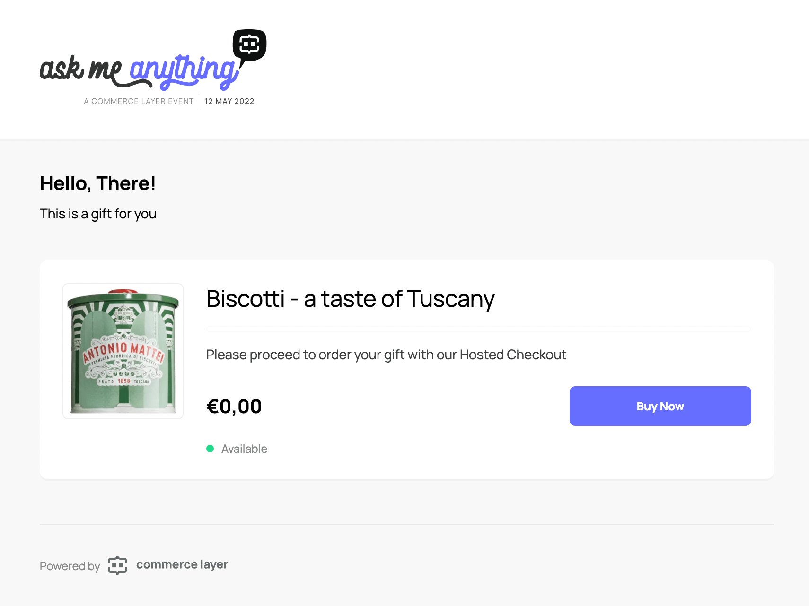

# Commerce Layer Microstore

The Commerce Layer Microstore application (React) provides you with a production-ready microstore website powered by Commerce Layer APIs. Microstores are self-contained and fully functional hosted stores accessible via a unique URL, which can be embedded into any online or offline (e.g. using a QR code) content. You can fork this repository and deploy it to any hosting service or use it as a reference application to build your own. A hosted version is also available.



## What is Commerce Layer?

[Commerce Layer](https://commercelayer.io) is a multi-market commerce API and order management system that lets you add global shopping capabilities to any website, mobile app, chatbot, wearable, voice, or IoT device, with ease. Compose your stack with the best-of-breed tools you already mastered and love. Make any experience shoppable, anywhere, through a blazing-fast, enterprise-grade, and secure API.

## Table of contents

- [Getting started](#getting-started)
- [Hosted version](#hosted-version)
- [Contributors guide](#contributors-guide)
- [Help and support](#need-help)
- [License](#license)

---

## Getting started

1. Deploy the forked repository to your preferred hosting service or host it yourself. You can deploy with one click below:

2. Create your organization and get your credentials by following one of our [onboarding tutorials](https://docs.commercelayer.io/developers/welcome).

3. Build your sales channel with your favorite technologies and frameworks by leveraging our [developer resources](https://commercelayer.io/developers) and [documentation](https://docs.commercelayer.io/api).

4. Get an [access token](https://docs.commercelayer.io/api/authentication) for your application. You should generate this in your sales channel or use our JavaScript [authentication library](https://github.com/commercelayer/commercelayer-js-auth).

5. Create one or more [SKUs](https://commercelayer.io/docs/data-model/skus) associated with prices and inventories.

6. Open the microstore using the URL format: `<your-deployed-microstore-url>/microstore?skus=<skuCodes-comma-separated>accessToken=<your-access-token>`. For example: `https://microstore.yourbrand.com/microstore?skus=TSHIRT123,TANK123&accessToken=eyJhbGciOiJIUzUxMiJ9`.

## Hosted version

Any Commerce Layer account comes with a hosted version of the microstore application. You can customize it by adding your organization logo, favicon, and primary color.

You can use the hosted version of the microstore application by building the related URL with the following format: `https://<your-organization-subdomain>.commercelayer.app/microstore?skus=<skuCodes-comma-separated>accessToken=<your-access-token>`.

The default behavior is the _Buy Now_ mode. This means that as soon as customers add a product to the shopping bag they are redirected directly to checkout. If other line items were present in the order, they will be deleted.

### URL parameters

| Parameter     | Description                                                                                                                                                                                                   |
| ------------- | ------------------------------------------------------------------------------------------------------------------------------------------------------------------------------------------------------------- |
| `accessToken` | A valid sales channel access token.                                                                                                                                                                           |
| `skus`        | SKU codes, comma separated. You can use colon to add a default quantity (e.g. `TSHIRT123:4` will add 4 of the specified SKU to the microstore). Default quantity is **1**.                                    |
| `all`         | If `true`, a _Buy All_ button is activated on top of the products list. This will clear the line items of the order and add all the items listed on the page to the order (with the quantity set in the URL). |
| `cart`        | If `true`, the microstore application will work together with the [cart](https://github.com/commercelayer/commercelayer-cart) one.                                                                            |

`https://<your-organization-subdomain>.commercelayer.app/microstore?skus=<skuCode-comma-separated>accessToken=<your-access-token>`

For example: `https://yourbrand.checkout.commercelayer.app/microstore?skus=TSHIRT123:4&accessToken=eyJhbGciOiJIUzUxMiJ9`

### Cart options

> When the microstore app works in conjunction with the [cart](https://github.com/commercelayer/commercelayer-cart) one, we decided to disable the _Buy Now_ mode, so as to avoid removing previous line items from the order on the "Buy now" button click.

Enabling the cart will add a behavior option about how the items are added to the shopping bag:

| Parameter | Description                                                                                                                                          |
| --------- | ---------------------------------------------------------------------------------------------------------------------------------------------------- |
| `inline`  | If `true`, when customers click on the "Add to bag" button, they will remain on the page, otherwise they will be redirected immediately to the cart. |

For example: `https://yourbrand.checkout.commercelayer.app/microstore?skus=TSHIRT123:4&accessToken=eyJhbGciOiJIUzUxMiJ9&cart=true&inline=true`

## Contributors guide

1. Fork [this repository](https://github.com/commercelayer/commercelayer-microstore) (you can learn how to do this [here](https://help.github.com/articles/fork-a-repo)).

2. Clone the forked repository like so:

```bash
git clone https://github.com/<your username>/commercelayer-microstore.git && cd commercelayer-microstore
```

3. First, install dependencies and run the development server:

```
yarn install
yarn dev
```

4. Set your environment with `.env.local` starting from `.env.local.sample`.

5. Open [http://localhost:3000](http://localhost:3000) with your browser to see the result. You can use the following format to open the checkout: `http://localhost:3000/microstore?skus=<your-sku-code>&accessToken=<your-access-token>`.

6. Make your changes and create a pull request ([learn how to do this](https://docs.github.com/en/github/collaborating-with-issues-and-pull-requests/creating-a-pull-request)).

7. Someone will attend to your pull request and provide some feedback.

## Need help?

1. Join [Commerce Layer's Slack community](https://slack.commercelayer.app).

2. Create an [issue](https://github.com/commercelayer/commercelayer-microstore/issues) in this repository.

3. Ping us [on Twitter](https://twitter.com/commercelayer).

## License

This repository is published under the [MIT](LICENSE) license.
